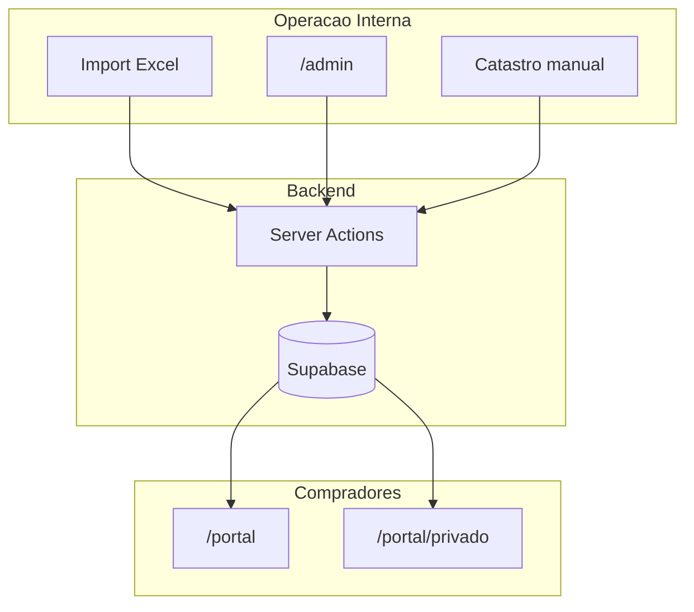

# Documentação PropCRM (Unihabitat)

> **Propósito:** Índice central da documentação do CRM imobiliário para carteiras NPL/CDR na Espanha.  
> **Público:** Desenvolvedores e equipa de operação.  
> **Última verificação:** 2026-06-12

PropCRM gere imóveis físicos (**inmuebles**), cargas financeiras (**propiedades**), compradores, agentes, ofertas e matching automático. A UI está em espanhol; esta documentação meta está em português.

## Mapa do sistema

## Começar aqui

| Documento | Para quem | Descrição |
|-----------|-----------|-----------|
| [Setup local](getting-started/setup-local.md) | Dev | Instalar, `.env`, `npm run dev` |
| [Primeiro acesso](getting-started/primeiro-acesso.md) | Dev / QA | Login demo, roles, rotas |
| [Glossário](getting-started/glossario.md) | Todos | NPL, CDR, inmueble, propiedad… |

## Guias de operação

| Documento | Descrição |
|-----------|-----------|
| [Importar Excel (admin)](guias/admin-importar-excel.md) | Upload da plantilla CDR/NPL |
| [Gestão de activos (admin)](guias/admin-gestao-activos.md) | Publicar, Catastro, convites |
| [Portal do comprador](guias/portal-comprador.md) | Favoritos, ofertas, área privada |
| [Matching e oportunidades](guias/matching-oportunidades.md) | Como funcionam os matches |

## Arquitetura

| Documento | Descrição |
|-----------|-----------|
| [Visão geral](arquitetura/visao-geral.md) | Stack, camadas, fluxo de dados |
| [Modelo de dados](arquitetura/modelo-dados.md) | Asset vs Propiedad, mappers |
| [Auth e permissões](arquitetura/auth-e-permissoes.md) | Middleware, roles, vendedor ACL |
| [Server actions](arquitetura/server-actions.md) | Catálogo de actions por entidade |
| [Integrações](arquitetura/integracoes.md) | Supabase, Catastro, Geoapify, Resend |

## Fluxos técnicos

| Documento | Descrição |
|-----------|-----------|
| [Importação Excel](fluxos-tecnicos/importacao-excel.md) | Parser `parseTemplateExcel`, upsert |
| [Enriquecimento Catastro](fluxos-tecnicos/enriquecimento-catastro.md) | DNP + Geoapify (manual) |
| [Matching engine](fluxos-tecnicos/matching-engine.md) | Scoring comprador ↔ imóvel |
| [Email e notificações](fluxos-tecnicos/email-notificacoes.md) | Resend, templates, dry-run |

## Operações

| Documento | Descrição |
|-----------|-----------|
| [Variáveis de ambiente](operacoes/variaveis-ambiente.md) | Referência completa de env vars |
| [Migrations Supabase](operacoes/migrations-supabase.md) | Ficheiros SQL e ordem |
| [Deploy Vercel](operacoes/deploy-vercel.md) | Build, env, domínio |
| [Troubleshooting](operacoes/troubleshooting.md) | Problemas comuns |

## Contribuir

| Documento | Descrição |
|-----------|-----------|
| [Convenções de código](contribuir/convencoes-codigo.md) | snake_case, server actions, espanhol |
| [Manter documentação](contribuir/manter-documentacao.md) | Pipeline docs-as-code, checklist PR |

## Ficheiros relacionados

- [README.md](../README.md) — cartão de visita do repositório
- [CLAUDE.md](../CLAUDE.md) — guia curto para agentes de IA
- [.env.example](../.env.example) — template de variáveis

## Diagramas

- [diagrams/flow.excalidraw](diagrams/flow.excalidraw) — diagrama visual (workshop; preferir Mermaid nos `.md`)
