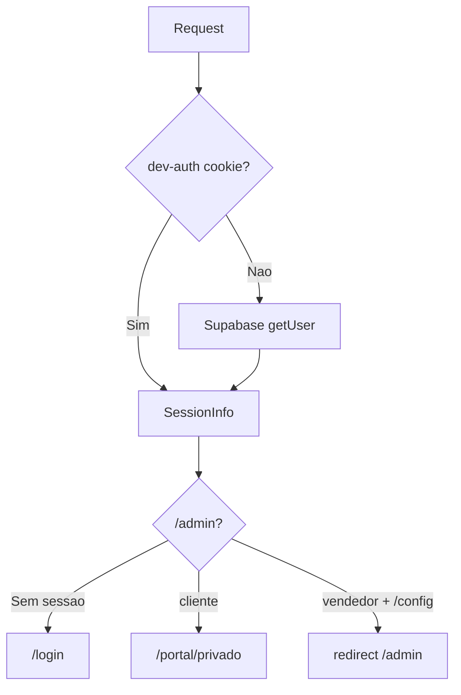

# Auth e permissões

> **Propósito:** Documentar autenticação, roles e ACL de vendedores.  
> **Público:** Desenvolvedores.  
> **Última verificação:** 2026-06-12

## Roles

| Role | Origem | Acesso |
|------|--------|--------|
| `admin` | `user_metadata.role` ou dev-auth | `/admin` completo incl. `/admin/config` |
| `vendedor` | idem | `/admin` excepto `/admin/config`; permissões por secção |
| `cliente` | default Supabase / dev-auth | `/portal/privado` |

## Middleware

[`src/middleware.ts`](../../src/middleware.ts) — matcher: `/admin/*`, `/portal/privado/*`, `/login`.

**Prioridade:** cookie `dev-auth` > Supabase.

Cookies Supabase refrescadas durante `getUser()` são copiadas para redirects (evita perder sessão).

## Login

[`src/app/login/actions.ts`](../../src/app/login/actions.ts):

1. Email em `DEV_USERS` → cookie `dev-auth`, redirect por role
2. Caso contrário → Supabase `signInWithPassword` / `signUp`
3. Sign-up cria `comprador` via `upsertComprador`

Contas demo — ver [setup-local.md](../getting-started/setup-local.md).

## Auth no servidor

[`src/lib/auth-server.ts`](../../src/lib/auth-server.ts):

- `getServerSession()` — role, email, ids vendedor/comprador
- `requireAdmin()` — aborta se não admin
- `requireAdminOrVendor()` — admin ou vendedor
- `requireEditPermission(section)` — verifica ACL vendedor

## Permissões vendedor (UI)

[`src/lib/permissions.ts`](../../src/lib/permissions.ts) define secções: `activos`, `compradores`, `ofertas`, etc.

- `canViewSection` / `canEditSection` — [`auth-helpers.ts`](../../src/lib/auth-helpers.ts)
- Layout admin filtra nav: [`src/app/admin/layout.tsx`](../../src/app/admin/layout.tsx)
- `VendorGuard` — guard por página

Tabela DB: `vendedor_permissions`. Actions: [`permissions.ts`](../../src/app/actions/permissions.ts).

## Portal auth

[`src/hooks/usePortalAuth.ts`](../../src/hooks/usePortalAuth.ts) — distingue staff (vê catálogo completo) vs visitante/comprador.

## RLS Supabase

Políticas em `supabase-schema.sql` e `supabase-dev-policies.sql`. Função helper `is_admin()` para políticas admin.

Writes sensíveis usam **service-role** nas server actions (bypass RLS controlado no código).

## Ficheiros relacionados

- [`src/middleware.ts`](../../src/middleware.ts)
- [`src/lib/dev-auth-client.ts`](../../src/lib/dev-auth-client.ts)
- [primeiro-acesso.md](../getting-started/primeiro-acesso.md)
