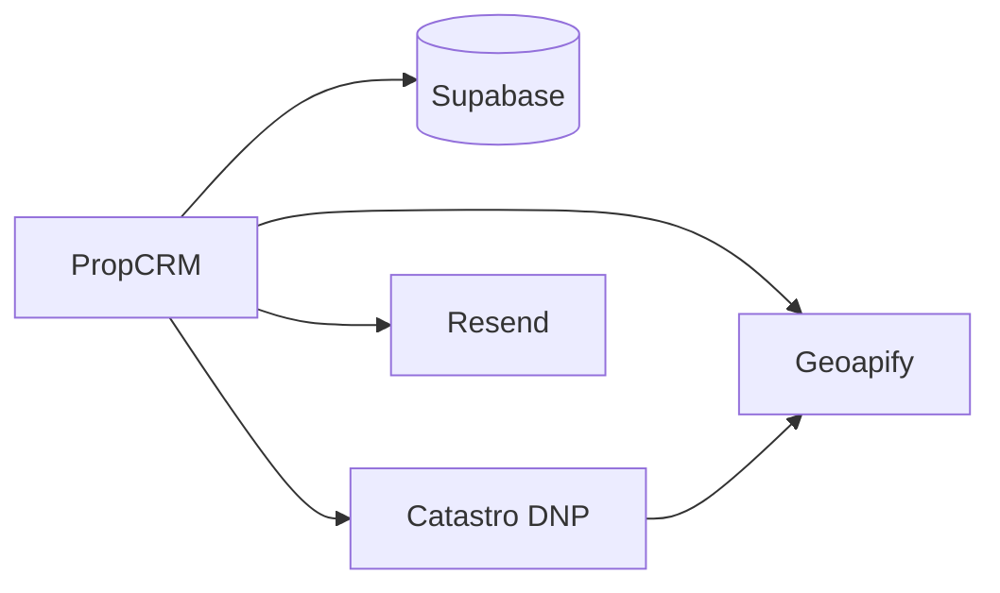

# Integrações externas

> **Propósito:** Referência das APIs e serviços externos.  
> **Público:** Desenvolvedores.  
> **Última verificação:** 2026-06-12

## Supabase

**Uso:** PostgreSQL, Auth, Storage (documentos).

| Cliente | Ficheiro | Quando |
|---------|----------|--------|
| Browser | `src/lib/supabase/client.ts` | Auth portal, sessão cliente |
| Server (anon + cookies) | `src/lib/supabase/server.ts` | Reads com RLS |
| Service role | `createServiceClient()` | Writes admin, upsert Excel |

Scripts: `scripts/test-supabase-connection.mjs`, `scripts/fix-postgrest-schema.mjs`.

## Catastro (cadastro espanhol)

**API:** `Consulta_DNPRC` via [`src/lib/catastro/dnp.ts`](../../src/lib/catastro/dnp.ts)

**Fluxo manual** ([`catastro.ts`](../../src/app/actions/catastro.ts)):

1. Validar referência catastral (`asset.id`)
2. Consultar DNP → partial asset
3. Geocode + mapa estático (Geoapify)
4. Merge em [`merge-asset-partial.ts`](../../src/lib/merge-asset-partial.ts) — não apaga dados CRM existentes

**Script Python standalone:** [`catastro.py`](../../catastro.py) — batch Excel + Geoapify (equivalente offline).

Env: `ASSET_UPSERT_AFTER_CATASTRO_ENRICH=true` persiste após enrich.

## Geoapify

**Uso:** Geocodificação e URLs de mapas estáticos.

| Ficheiro | Função |
|----------|--------|
| `src/lib/catastro/geoapify.ts` | `geocodeAddressLine`, `buildStaticMapUrl` |
| `src/lib/catastro/geocode-ladder.ts` | Estratégia em cascata (7 passos) |
| `src/app/actions/maps.ts` | Backfill em lote |

**Chaves:** `GEOAPIFY_API_KEY` (servidor) ou `NEXT_PUBLIC_GEOAPIFY_KEY` (cliente).

Smoke test: `npm run test:env` → `scripts/geoapify-smoke.mjs`.

Diagnósticos: `actions/diagnostics.ts` → `pingGeoapify`.

## Resend (email)

| Ficheiro | Função |
|----------|--------|
| `src/lib/email/resend.ts` | Cliente, defaults `EMAIL_FROM`, `EMAIL_SUPPORT` |
| `src/lib/email/send.ts` | `sendEmail()` — dry-run ou API |
| `src/lib/email/templates.ts` | HTML/texto |

**Casos de uso:** contacto, solicitud información, ofertas, notificações, convites agentes.

**Dev:** `EMAIL_DRY_RUN=true` — log na consola, sem envio.

Ver [email-notificacoes.md](../fluxos-tecnicos/email-notificacoes.md).

## Leaflet (mapas UI)

Componentes: `InteractiveMap.tsx`, `AssetMapImage.tsx` — mapas interactivos no portal/admin.

## Dependência Anthropic

`@anthropic-ai/sdk` está em `package.json` mas **não há implementação activa** de validação IA no código actual. Não configurar `ANTHROPIC_API_KEY` esperando pipeline de import automático.

## Diagrama

## Ficheiros relacionados

- [variaveis-ambiente.md](../operacoes/variaveis-ambiente.md)
- [enriquecimento-catastro.md](../fluxos-tecnicos/enriquecimento-catastro.md)
