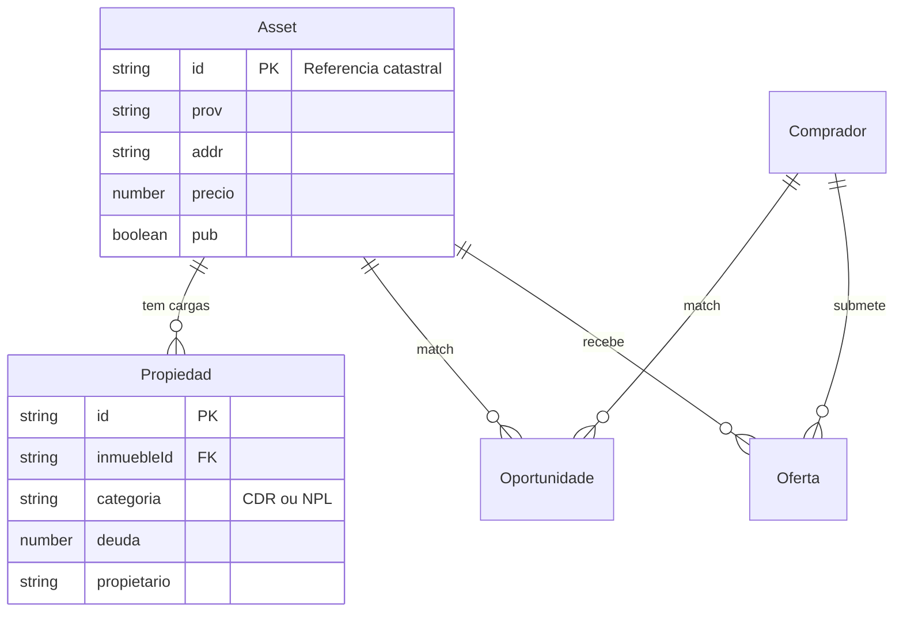

# Modelo de dados

> **Propósito:** Explicar a separação Inmueble (Asset) vs Propiedad (carga) e o mapeamento DB.  
> **Público:** Desenvolvedores e operação (conceitos).  
> **Última verificação:** 2026-06-12

## Conceito central

Após a migração `inmuebles ↔ propiedades`, o modelo distingue:

| Entidade | O que representa | Chave primária |
|--------|------------------|---------------|
| **Asset (Inmueble)** | Imóvel físico — endereço, tipologia, preço, mapa, publicação | `Referencia` catastral |
| **Propiedad** | Carga / lien / colateral — devedor, dívida, fase judicial, IDs origem | Collateral ID / ID Property / hash |

**Regra:** 1 linha Excel → 1 propiedad. Várias linhas com a mesma `Referencia` → 1 inmueble (merge campo a campo, fill-empty).

## Asset (Inmueble)

Campos principais em [`src/lib/types.ts`](../../src/lib/types.ts):

- **Identificação:** `id` (= referência catastral), endereço (`prov`, `pob`, `cp`, `addr`, `fullAddr`)
- **Tipologia:** `tip`, `tipC`, `bien`, `clase`, `uso`
- **Comercial:** `precio`, `desc`, `pub` (publicado no portal)
- **Físico:** `sqm`, coordenadas `lat`/`lng`, `map` (URL mapa estático)
- **Relação:** `propiedades: Propiedad[]` (embebido após fetch)

## Propiedad (Carga)

- **Ligação:** `inmuebleId` → `Asset.id`, `activoId` → coluna Excel `ID1`
- **Categoria:** `CDR` | `NPL` — determina colunas extra no parser
- **Comercial/judicial:** `propietario`, `deuda`, `faseInterna`, `proceso`, `portfolio`, etc.
- **Auditoria:** `excelRaw` — linha original por folha/cabeçalho

Campos que antes viviam em `asset.adm.*` devem ser lidos de `asset.propiedades[]`.

## Outras entidades

| Entidade | Tabela Supabase | Notas |
|----------|-----------------|-------|
| Comprador | `compradores` | Ligado a `auth.users`; interesses, presupuesto, NDA |
| Vendedor | `vendedores` | Agente; convite via Supabase Auth |
| Tarea | `tareas` | Tarefas internas |
| Oportunidade | `oportunidades` | Match com score |
| Oferta | `ofertas` | Proposta + estados NDA |
| Notificacion | `notificaciones` | Alertas in-app (+ email espelhado) |

Tabelas de relação: `comprador_assets` (convites), `comprador_favoritos`, `vendedor_permissions`, `vendedor_assets`, `vendedor_compradores`.

## Mappers (`db.ts`)

Todo acesso DB passa por [`src/lib/supabase/db.ts`](../../src/lib/supabase/db.ts):

- `rowToAsset` / `assetToRow` — tabela `assets`
- `rowToPropiedad` / `propiedadToRow` — tabela `propiedades`
- `rowToPropiedadPublic` — variant sem PII para portal
- `attachPropiedades(assets, propiedades)` — junta arrays após fetch separado

**Convenção:** colunas PostgreSQL em `snake_case`; modelos TypeScript em `camelCase`.

## Schema SQL

| Ficheiro | Conteúdo |
|----------|----------|
| `supabase-schema.sql` | Schema inicial (legacy parcial) |
| `supabase-migration-inmuebles-propiedades.sql` | Separação Asset/Propiedad |
| `supabase-migration-excel-raw.sql` | Coluna excel_raw |
| `supabase-dev-policies.sql` | RLS permissivo para dev |

Ver [migrations-supabase.md](../operacoes/migrations-supabase.md).

## Ficheiros relacionados

- [`src/lib/types.ts`](../../src/lib/types.ts)
- [`src/lib/normalize-excel.ts`](../../src/lib/normalize-excel.ts) — Excel → Asset + Propiedad
- [`src/app/actions/assets.ts`](../../src/app/actions/assets.ts) — upsert/fetch
