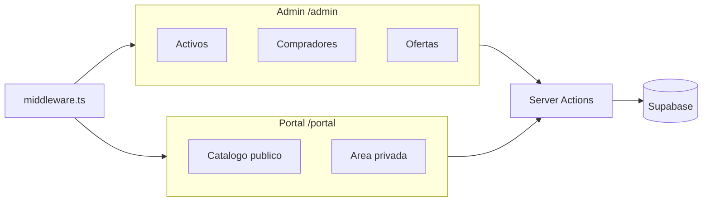
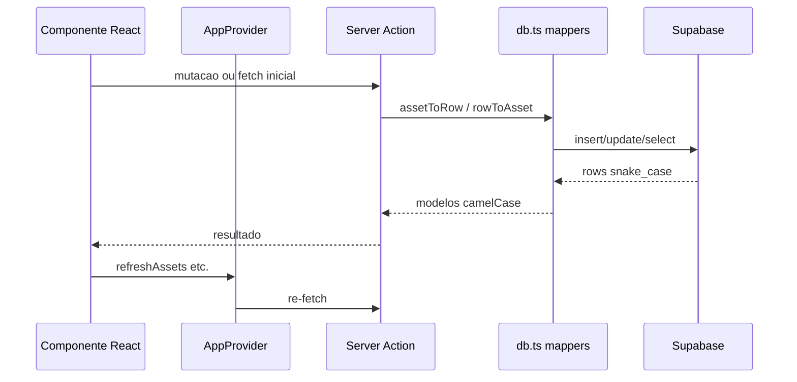

# Visão geral da arquitetura

> **Propósito:** Descrever stack, camadas e fluxo de dados do PropCRM.  
> **Público:** Desenvolvedores.  
> **Última verificação:** 2026-06-12

## Stack

| Camada | Tecnologia |
|--------|------------|
| Framework | Next.js 16 (App Router) |
| UI | React 19, Tailwind CSS 4, Lucide icons |
| Linguagem | TypeScript |
| Backend / DB | Supabase (PostgreSQL + Auth + Storage) |
| Email | Resend |
| Excel | `xlsx` (SheetJS) |
| Mapas | Leaflet, Geoapify |
| Testes | Vitest (unit), Playwright (E2E) |

**Alias de paths:** `@/*` → `src/*`

## Interfaces



- **Admin** — CRM interno: import Excel, gestão de activos/compradores/agentes, ofertas, matching
- **Portal público** — imóveis com `pub=true`; dados sensíveis ocultos para anónimos
- **Portal privado** — compradores autenticados: favoritos, convites, ofertas

Não existem rotas em `src/app/api/`. Toda leitura/escrita passa por **server actions** em `src/app/actions/`.

## Fluxo de dados



1. **Server actions** — mutações via `createServiceClient()` (service-role); reads conforme RLS ou service-role
2. **Mappers** — [`src/lib/supabase/db.ts`](../../src/lib/supabase/db.ts) converte snake_case ↔ camelCase
3. **React Context** — [`src/lib/context.tsx`](../../src/lib/context.tsx) mantém `assets`, `compradores`, `vendedores`, `tareas` no cliente com métodos `refresh*`

## Autenticação

Middleware em [`src/middleware.ts`](../../src/middleware.ts) protege rotas. Sessão via Supabase cookies ou cookie `dev-auth` (local). Detalhes: [auth-e-permissoes.md](auth-e-permissoes.md).

## Módulos principais

| Módulo | Ficheiros | Função |
|--------|-----------|--------|
| Excel import | `normalize-excel.ts`, `UploadActivosModal.tsx` | Parser plantilla CDR/NPL |
| Catastro | `lib/catastro/*`, `actions/catastro.ts` | Enriquecimento cadastral manual |
| Matching | `lib/matching.ts`, `actions/matching.ts` | Score comprador ↔ imóvel |
| Email | `lib/email/*` | Resend + templates |
| Permissões | `lib/permissions.ts`, `actions/permissions.ts` | ACL vendedor por secção |

## Modelo de dados

Um **inmueble** (`Asset`) agrupa N **propiedades** (`Propiedad`). Ver [modelo-dados.md](modelo-dados.md).

## Deploy

Next.js na Vercel. Variáveis de ambiente documentadas em [variaveis-ambiente.md](../operacoes/variaveis-ambiente.md).

## Ficheiros âncora

```
src/middleware.ts
src/app/layout.tsx          # AppProvider
src/lib/context.tsx
src/lib/types.ts
src/lib/supabase/db.ts
src/app/actions/
```

## Documentação relacionada

- [modelo-dados.md](modelo-dados.md)
- [server-actions.md](server-actions.md)
- [integracoes.md](integracoes.md)
