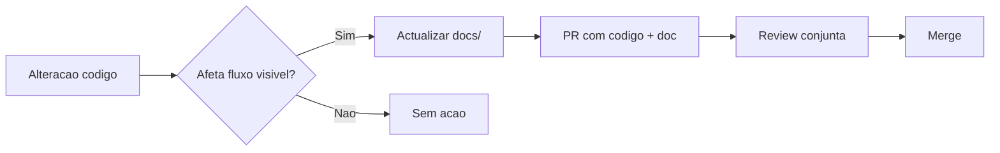

# Manter documentação

> **Propósito:** Pipeline docs-as-code e processo de manutenção contínua.  
> **Público:** Toda a equipa que contribui código.  
> **Última verificação:** 2026-06-12

## Princípios

1. **Docs-as-code** — documentação em `docs/`, versionada com o código
2. **Uma fonte de verdade** — evitar duplicatas (ex.: doc Excel só em `fluxos-tecnicos/importacao-excel.md`)
3. **Mermaid nos `.md`** — diagramas versionáveis; Excalidraw só para workshops
4. **CLAUDE.md curto** — aponta para `docs/`, não duplica tudo
5. **Testes como prova** — referenciar ficheiros de teste nos fluxos técnicos

## Pipeline

## Checklist PR (manual)

Antes de merge, confirmar:

- [ ] Comportamento novo ou alterado está documentado em `docs/`
- [ ] `CLAUDE.md` actualizado se mudou arquitectura ou comandos
- [ ] `.env.example` + `docs/operacoes/variaveis-ambiente.md` se nova env var
- [ ] Links no `docs/README.md` se novo documento
- [ ] Nenhuma doc descreve código removido

## Quando actualizar o quê

| Mudança | Documento |
|---------|-----------|
| Nova rota admin/portal | `arquitetura/visao-geral.md` + guia em `guias/` |
| Server action nova/alterada | `arquitetura/server-actions.md` |
| Parser Excel / colunas | `fluxos-tecnicos/importacao-excel.md` + `guias/admin-importar-excel.md` |
| Schema Supabase | `arquitetura/modelo-dados.md` + `operacoes/migrations-supabase.md` |
| Nova env var | `.env.example` + `operacoes/variaveis-ambiente.md` |
| Auth / permissões | `arquitetura/auth-e-permissoes.md` |
| Integração externa | `arquitetura/integracoes.md` |

## Template mínimo por documento

Cada ficheiro em `docs/` deve incluir:

1. **Propósito** (1 frase)
2. **Público** (dev / operação / ambos)
3. **Pré-requisitos** (se aplicável)
4. Conteúdo principal
5. **Ficheiros relacionados** (links relativos)
6. **Última verificação** (data)

## Revisão trimestral

A cada ~3 meses (ou após refactor grande):

1. Percorrer `docs/fluxos-tecnicos/` vs código (`UploadActivosModal`, `normalize-excel.ts`)
2. Verificar `server-actions.md` vs exports em `src/app/actions/`
3. Confirmar env vars vs `.env.example`
4. Remover ou arquivar docs obsoletas (stub de redirect como em `fluxo-importacao-excel.md`)

## Índice central

Manter [docs/README.md](../README.md) como hub — adicionar link sempre que criar novo documento.

## Métricas de sucesso

- Novo developer: setup + login demo em < 30 min só com docs
- Operador: import Excel + publicar imóvel sem suporte
- Zero docs que descrevam código inexistente

## Ficheiros relacionados

- [docs/README.md](../README.md)
- [convencoes-codigo.md](convencoes-codigo.md)
