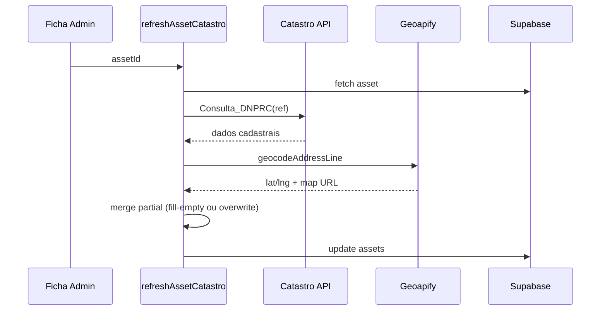

# Enriquecimento Catastro

> **Propósito:** Fluxo técnico de actualização cadastral manual.  
> **Público:** Desenvolvedores.  
> **Última verificação:** 2026-06-12

## Quando usar

- **Não** faz parte do upload Excel
- Acionado na **ficha do imóvel (admin)** — botão refresh Catastro
- Útil quando Excel não traz coordenadas/dados físicos completos ou para actualizar cadastro

## Fluxo

## Função pública

[`refreshAssetCatastro(assetId, opts?)`](../../src/app/actions/catastro.ts)

- Requer **admin** (`requireAdmin`)
- `asset.id` = referência catastral
- `opts.forceOverwrite` — sobrescreve campos existentes; default merge fill-empty via [`merge-asset-partial.ts`](../../src/lib/merge-asset-partial.ts)

## Backfill em lote

[`maps.ts`](../../src/app/actions/maps.ts):

- `backfillMissingMaps` — imóveis sem mapa/coords
- `backfillUploadedMaps` — pós-upload (não chamado pelo modal actual)
- Usa [`geocode-ladder.ts`](../../src/lib/catastro/geocode-ladder.ts) — 7 estratégias de query

## Env

- `GEOAPIFY_API_KEY` ou `NEXT_PUBLIC_GEOAPIFY_KEY`
- `ASSET_UPSERT_AFTER_CATASTRO_ENRICH=true` — opcional persistência extra

## Script Python

[`catastro.py`](../../catastro.py) — processamento batch offline (Excel + API + Geoapify).

## Ficheiros relacionados

- [`src/lib/catastro/dnp.ts`](../../src/lib/catastro/dnp.ts)
- [`src/lib/catastro/to-partial-asset.ts`](../../src/lib/catastro/to-partial-asset.ts)
- [integracoes.md](../arquitetura/integracoes.md)
