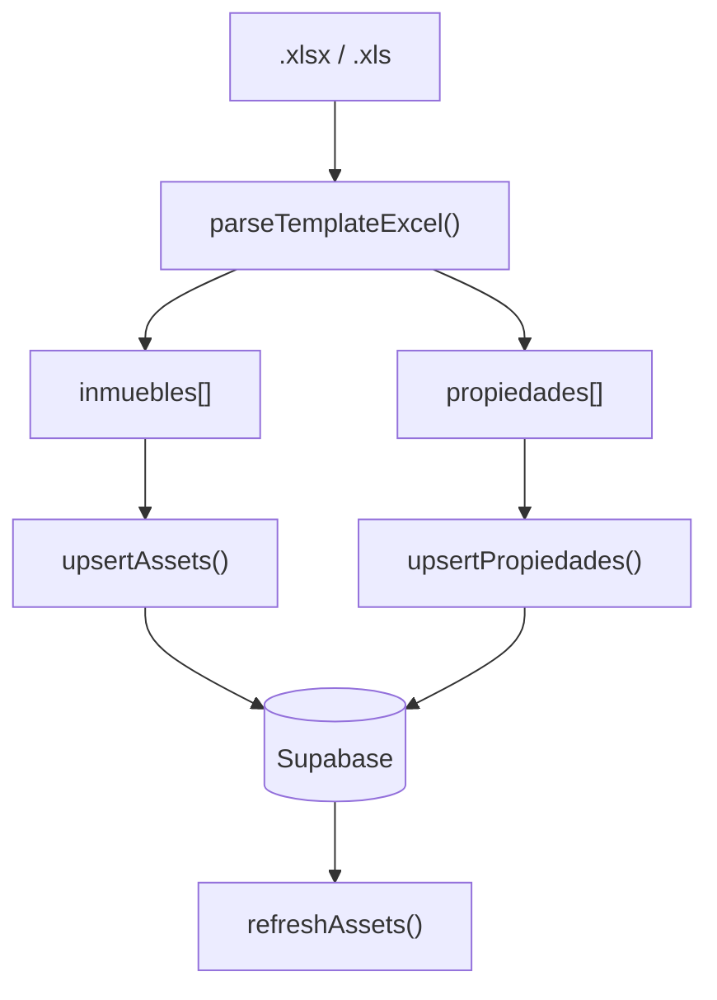

# Importação Excel (fluxo técnico)

> **Propósito:** Documentar o pipeline real de upload Excel no PropCRM.  
> **Público:** Desenvolvedores.  
> **Última verificação:** 2026-06-12

## Visão geral

O upload usa **2 passos** no cliente ([`UploadActivosModal.tsx`](../../src/app/admin/UploadActivosModal.tsx)):

1. **Leer Excel** — `parseTemplateExcel()` no browser
2. **Guardar en base de datos** — `upsertAssets` + `upsertPropiedades` + `refreshAssets`

**Não faz parte deste fluxo:** validação IA (Anthropic), enriquecimento Catastro automático, geocodificação em batch no upload. Catastro é acionado **manualmente** na ficha do imóvel ([`catastro.ts`](../../src/app/actions/catastro.ts)).

## Formato suportado

**Apenas** a plantilla maestra **CDR/NPL**. Formatos antigos (Proveedor 1/2/3 + Enriquecido) **não são suportados** — ver comentário em [`normalize-excel.ts`](../../src/lib/normalize-excel.ts).

### Regras de parsing

| Regra | Comportamento |
|-------|---------------|
| 1 linha Excel | 1 `Propiedad` |
| Mesma coluna `Referencia` | 1 `Asset`; linhas fundidas fill-empty |
| PK inmueble | Valor da coluna `Referencia` (catastral) |
| PK propiedad | `Collateral ID` (NPL) ou `ID Property` (CDR); fallback `{ID1}__{Referencia}` |
| Categoria | Coluna `Categoria` → `CDR` ou `NPL` (default CDR) |
| Publicar | Coluna `Publicar` → `SI`/`NO` → `asset.pub` |

### Cabeçalhos principais (núcleo comum)

Alias tolerantes a acentos e variantes (`CORE_HEADERS`):

- `Referencia`, `ID1`, `Categoria`
- `Propietario`, `Contacto`, `Telefono`, `mail`
- `Provincia`, `Municipio`, `Codigo Postal`, `Direccion Completa`
- `Bien`, `Clase`, `Uso`, `Precio`, `Deuda`, `Publicar`
- `Longitud`, `Latitud`, `Descripcion Activo`

Extensões por categoria em `CDR_EXT_HEADERS` e `NPL_EXT_HEADERS` (Portfolio, Collateral ID, Juzgado, etc.).

## Upsert na base de dados

[`assets.ts`](../../src/app/actions/assets.ts):

- **`upsertAssets`** — deduplica por `id`, merge com registos existentes (prefer non-empty), batches paralelos
- **`upsertPropiedades`** — upsert por PK da propiedad, FK `inmueble_id`

Após sucesso, o modal chama `refreshAssets()` do [`AppProvider`](../../src/lib/context.tsx).

## Diagnóstico

`ParseTemplateResult.diag` inclui:

- `rows`, `parsed`, `skipped`, `skippedReasons`
- `categoryCounts`: `{ CDR, NPL }`

Filas descartadas tipicamente: sem `Referencia`.

## O que verificar após import

1. Contagem inmuebles vs propiedades no log do modal
2. Lista `/admin` — activos visíveis
3. Ficha do imóvel — tab admin / propiedades associadas
4. Coordenadas: se Excel traz `Latitud`/`Longitud`, mapa pode aparecer; senão usar Catastro manual

## Testes

- [`src/__tests__/template-import.test.ts`](../../src/__tests__/template-import.test.ts) — parser
- [`src/__tests__/actions-assets.test.ts`](../../src/__tests__/actions-assets.test.ts) — upsert/merge
- [`tests/e2e/import-and-map.spec.ts`](../../tests/e2e/import-and-map.spec.ts) — E2E

## Guia operacional

Para passos na UI admin, ver [admin-importar-excel.md](../guias/admin-importar-excel.md).

## Histórico

Documentação anterior (`docs/fluxo-importacao-excel.md`) descrevia pipeline legado de 5–6 etapas com IA e Catastro no upload. Foi substituída por este documento alinhado ao código actual.

## Ficheiros relacionados

- [`src/lib/normalize-excel.ts`](../../src/lib/normalize-excel.ts)
- [`src/app/admin/UploadActivosModal.tsx`](../../src/app/admin/UploadActivosModal.tsx)
- [`src/lib/excel-raw-utils.ts`](../../src/lib/excel-raw-utils.ts)
