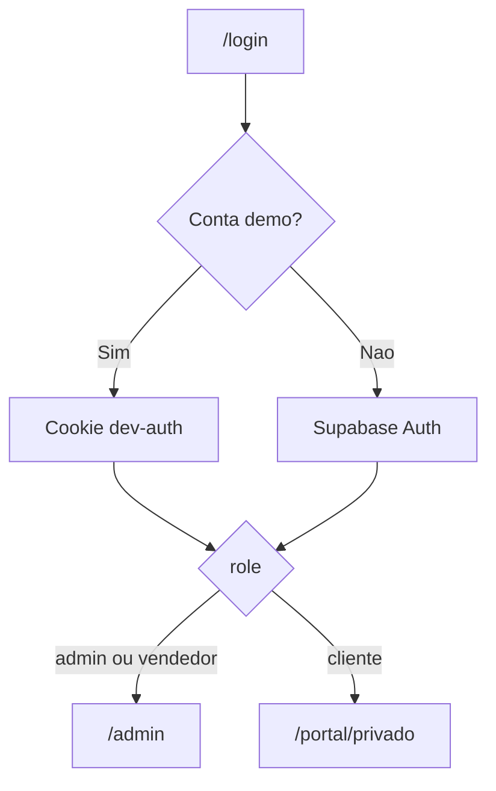

# Primeiro acesso

> **Propósito:** Orientar o primeiro login e navegação por roles.  
> **Público:** Desenvolvedores e QA.  
> **Pré-requisitos:** [Setup local](setup-local.md) concluído.  
> **Última verificação:** 2026-06-12

## Rotas principais

| URL | Quem acede | Descrição |
|-----|------------|-----------|
| `/` | Todos | Landing com busca de activos |
| `/login` | Todos | Autenticação email/password |
| `/admin` | admin, vendedor | Painel CRM (lista de activos, upload Excel) |
| `/admin/compradores` | admin, vendedor* | Pipeline de compradores |
| `/admin/ofertas` | admin, vendedor* | Validar propostas |
| `/admin/oportunidades` | admin, vendedor* | Matches comprador ↔ imóvel |
| `/admin/config` | **só admin** | Configuração |
| `/portal` | Todos | Catálogo público (só imóveis `pub=true`) |
| `/portal/[id]` | Todos | Ficha pública do imóvel |
| `/portal/privado` | Autenticado | Área do comprador |
| `/portal/privado/ofertas` | Autenticado | Ofertas do comprador |

\* Vendedor: secções visíveis conforme permissões em `vendedor_permissions`.

## Fluxo de login

1. Ir a `/login`
2. Inserir email e password
3. Redirect automático conforme `user_metadata.role` (Supabase) ou conta demo

## Contas demo (desenvolvimento)

Ver [setup-local.md](setup-local.md). Após login como admin, experimentar:

1. **Activos** — `/admin` — lista e botão de upload Excel
2. **Detalhe** — clicar num activo → publicar, Catastro, convites
3. **Portal** — `/portal` — ver imóveis publicados

Como `cliente@propcrm.com`, ver `/portal/privado` (catálogo autenticado + favoritos).

## Middleware

Proteção em [`src/middleware.ts`](../../src/middleware.ts):

- `/admin/*` — requer sessão com role `admin` ou `vendedor`
- `/portal/privado/*` — requer qualquer sessão
- `/login` — redirect se já autenticado
- Vendedor bloqueado em `/admin/config`

Prioridade de sessão: cookie `dev-auth` > Supabase.

## Ficheiros relacionados

- [`src/middleware.ts`](../../src/middleware.ts)
- [`src/app/login/page.tsx`](../../src/app/login/page.tsx)
- [`docs/arquitetura/auth-e-permissoes.md`](../arquitetura/auth-e-permissoes.md)
