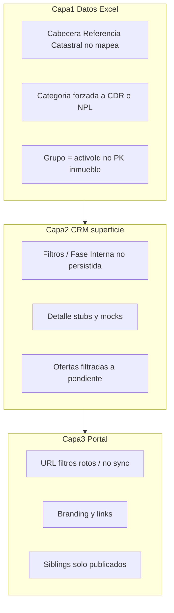

# Mejoras Unihabitat — CRM + Web (plan completo)

## Estrategia (estructura del problema)

Hay **tres capas de fallo independientes**. Arreglar UI sin la capa de datos no cierra el backlog del PDF.



1. **Capa datos (Excel → DB):** categorías, cabeceras, semántica ID1 vs PK.
2. **Capa CRM:** filtros, edición, ofertas visibles, compradores, emails.
3. **Capa portal:** persistencia filtros, marca, mapa, deuda NPL, grupos.

Orden de implementación: **1 → 2 → 3**. Sin (1), los filtros/portal siguen mentir sobre categorías y grupos.

---

## Diagnóstico cerrado — contraejemplos incondicionales

Cada ítem se demuestra con entrada fija → salida del código actual, sin “si el Excel viene mal”.

### CE-1 — Plantilla del cliente no encuentra Referencia

**Entrada (PDF del cliente):** cabeceras  
`Propietario | Telefono | mail | Publicar | Categoria | Fase Interna | Proceso | Referencia Catastral | Deuda | Precio | ID1`

**Código:** [`CORE_HEADERS.referencia = ["Referencia"]`](src/lib/normalize-excel.ts); `"Referencia Catastral"` solo en `CDR_EXT_HEADERS.referenciaCatastral` (no alimenta la PK).

**Salida verificada:** `indexOfHeader(headers, ["Referencia"]) === -1` →  
`parseTemplateExcel` lanza: `Cabecera "Referencia" no encontrada…`

**Consecuencia:** la plantilla que el cliente documenta **no importa** hasta aliasar `Referencia Catastral` en CORE.

### CE-2 — Categoría `OCUPADO` siempre se convierte en `CDR`

**Entrada:** celda `Categoria = "OCUPADO"`.

**Código:**
```ts
const categoria: "CDR" | "NPL" = catRaw === "NPL" ? "NPL" : "CDR";
```

**Salida:** `categoria === "CDR"`. Además DB: `check (categoria in ('CDR', 'NPL'))`.

**Consecuencia:** el filtro Categoría nunca mostrará OCUPADO; todo no-NPL se contabiliza como CDR.

### CE-3 — ID1 repetido NO se descarta por ID1 (el síntoma es otro)

**Entrada:** dos filas con cabecera oficial `Referencia` + `ID1`:

| ID1 | Referencia |
|-----|------------|
| GROUP-01 | AAA1111VK1111A0001AA |
| GROUP-01 | BBB2222VK2222B0002BB |

**Código:** `inmuebleId = \`${id1}__${referencia}\``.

**Salida:** dos assets distintos  
`GROUP-01__AAA…` y `GROUP-01__BBB…`, mismo `propiedad.activoId = "GROUP-01"`.

**Por tanto:** el parser **no** colapsa por ID1. Lo que el usuario llama “desechar duplicados” es una de:

| Mecanismo real | Cuándo |
|----------------|--------|
| Log `duplicatesMerged` | Mismo `asset.id` / `propiedad.id` (mismo ID1 **y** misma RC, o Collateral ID repetido) |
| Skip `sin Referencia` | Columna RC no mapeada / vacía |
| Expectativa de “grupo” | Admin lista **1 fila por inmueble**; no hay UI de grupo por `activoId` |
| Portal “varios / uno” | Badge usa `catalogAssets` + `propiedades[0].activoId`; siblings en detalle = `fetchPublicAssets()` filtrado por `pub` y excluye el actual |

**Fix de producto:** UI de grupo por `activoId` + query de siblings por `activo_id` (todos los publicados del grupo, listando también el actual). No “revertir dedup por ID1”.

### CE-4 — Filtros portal: `?pob=` alimenta el buscador de texto, no el filtro Población

**Entrada:** `/portal?pob=Alicante`

**Código** ([`portal/page.tsx`](src/app/portal/page.tsx)):
```ts
const [q, setQ] = useState(searchParams.get("pob") ?? "");
const [fPob, setFPob] = useState("");
```

**Salida:** `q === "Alicante"`, `fPob === ""`. El select Población no queda aplicado. Además los cambios de filtro **no se escriben** en la URL → al volver del detalle se pierden.

### CE-5 — `?cat=REO` no puede devolver resultados

**Entrada:** link footer/home `/portal?cat=REO`.

**Código:** tras CE-2 solo existen categorías `CDR`|`NPL` en DB; match es igualdad exacta (fold).

**Salida:** 0 activos. Decisión de plan: REO → `/portal` sin query.

### CE-6 — Situación admin vs Fase Interna

**Entrada:** admin cambia select “Fase Interna” en pestaña Administrador.

**Código:** select estático, **sin** `onChange` → DB; `updateAssetFields` escribe tabla `assets`, no `propiedades.fase_interna`.

**Salida:** valor en DB inalterado. El filtro Situación solo ve lo que vino del Excel (p.ej. “Publicado” / “En venta” en tests), no el enum de 8 valores del negocio.

### CE-7 — Ofertas “borradas”

**Entrada:** oferta con `estado` pasa de `pendiente` a `validada` / `rechazada` / `nda_firmado`.

**Código:** [`fetchOfertasPendientes`](src/app/actions/ofertas.ts) → `.in("estado", ["pendiente", "nda_enviado"])`.

**Salida:** desaparece del listado admin; **sigue en** tabla `ofertas` y en portal comprador.

### CE-8 — Botón Buscar admin es no-op

**Entrada:** click “Buscar” en cabecera admin.

**Código:** `<button className=…>Buscar</button>` sin `onClick` ([`admin/page.tsx`](src/app/admin/page.tsx) ~L260).

**Salida:** nada. Los filtros ya filtran en render; el botón engaña (“el filtro no funciona”).

### CE-9 — Branding mixto

**Entrada:** cualquier página con footer / home.

**Código:** home ya tiene `Unihabitat*` con `text-gold`; footer copyright `PropCRM`; portal header `Unihabitat` sin `*`.

**Salida:** marca inconsistente. Fix: `BrandMark` con `*` negro en todas las superficies públicas.

---

## Decisiones de producto (fijadas)

| Tema | Decisión |
|------|----------|
| Categorías | Texto libre del Excel; filtro dinámico; drop CHECK DB |
| Situación | Enum fijo Fase Interna (8 valores); persistir en `propiedades` |
| Filtros admin | … Estado → Situación → **Proceso** → **Deuda** → orden Precio |
| Portal filtros | Solo 4: Categoría, Provincia, Población, Tipología; URL sync bidireccional |
| REO | Link a `/portal` |
| Branding | Unihabitat\* con asterisco **negro** en toda la web |
| Acceso cliente | `sin_acceso` hasta activación manual admin |
| Ofertas | Listar todos los estados; oportunidades enlazadas |
| ID1 | Grupo = `activoId`; no colapsar filas con RC distinta |

---

## Fase 1 — Capa datos + Activos CRM

### 1.1 Excel / categorías (cierra CE-1, CE-2)

Archivos: [`src/lib/normalize-excel.ts`](src/lib/normalize-excel.ts), [`src/lib/types.ts`](src/lib/types.ts), migración SQL nueva.

- `CORE_HEADERS.referencia`: añadir `"Referencia Catastral"`, `"ReferenciaCatastral"`
- Persistir categoría trim/raw; `Propiedad.categoria: string`
- Drop CHECK; `categoryCounts` dinámico
- `faseToCode` para los 8 valores de Situación
- Tests: plantilla mínima con cabeceras del PDF + fila OCUPADO + 2 filas mismo ID1 / RC distinta → 2 inmuebles, 1 grupo

### 1.2 Grupos ID1 (cierra CE-3)

- Admin list: badge “N inmuebles” por `activoId` (como portal)
- Detalle admin/portal: sección colaterales = **todos** los assets con ese `activoId` (incl. actual), query dedicada (no depender solo de `fetchPublicAssets` + exclude self)
- Upload modal: texto explícito — “fusionados = mismo id compuesto”, no “mismo ID1”
- Si Collateral ID / ID Property repetido: reportar en diag (hoy last-wins silencioso en `propsById`)

### 1.3 Filtros (cierra CE-4 parcialmente, CE-5, CE-6, CE-8)

- [`asset-filters.ts`](src/lib/asset-filters.ts): `proceso`, `deudaRange`; Situación = enum fijo
- Admin: inserts Proceso/Deuda; cablear Fase Interna → `updatePropiedadFields`; quitar o cablear Buscar
- Características: mostrar Deuda + Proceso
- Portal (inicio Fase 3, prep): no mapear `pob` → `q`

### 1.4 Detalle activo

- Consultar / Oferta → mismos flujos que portal (solicitud info / ofertas del activo)
- Descripción editable → `descr`
- Notas del activo bajo Descripción (admin escribe; agentes leen)
- Eliminar mock notas/chat en Administrador; vacío o `mensajes.ts` real

---

## Fase 2 — Compradores, Ofertas, Matching ✅

Seguimiento ops (migraciones / env / smoke): [`docs/seguimiento-tareas-cliente.md`](docs/seguimiento-tareas-cliente.md).

### 2.1 Compradores + acceso (NDA manual) ✅

- CRUD + `setCompradorAcceso`; portal privado bloquea `sin_acceso`
- UI editar / eliminar / desactivar; Nuevo Comprador funcional
- `firmarNDA` en oferta puede sincronizar flag NDA del comprador (sin automatizar acceso aún)

### 2.2 Email share (no welcome) ✅

- `assetSharedTemplate` con ficha + deep link; usar desde `inviteCompradorToAsset`
- Separar de `agentInviteTemplate`

### 2.3 Matching / alertas ✅

- `toggleAssetPub(true)` → `computeMatchesForAsset`
- Favoritos → notificación a admin/agente asignado

### 2.4 Ofertas (cierra CE-7) ✅

- Listado admin: todos los estados + filtro
- Oportunidades: historial de ofertas del par; actualizar estado oportunidad

### 2.5 Paridad agente / cliente ✅

- Oferta, solicitar info, matching en portal para `cliente` y `vendedor`

---

## Fase 3 — Portal web ✅

### 3.1 Brand (cierra CE-9) ✅

- `BrandMark`: Unihabitat + `*` negro; footer, portal, login, legal, metadata (no PropCRM)

### 3.2 Filtros (cierra CE-4, CE-5) ✅

- Leer/escribir `cat|prov|pob|tipo` en URL; `pob` → `fPob` (no `q`)
- Ocultar Situación/Estado al público
- REO → `/portal`

### 3.3 Links / CTA ✅

- Legal → `/legal/privacidad`, `/legal/politica-cookies`
- CTA contacto → ancla formulario / `/portal/contacto`

### 3.4 Mapa | Lista ✅

- Toggle; mapa markers con Leaflet existente (`PortalAssetsMap`)

### 3.5 Cliente privado ✅

- “Mis Notas” vía `notas.ts`; sustituir bloque “no disponible”

### 3.6 NPL Deuda vs Precio ✅

- Card/detalle: NPL muestra Deuda (`getPortalPriceDisplay`); Precio 0 / oferta según Excel; CDR muestra Precio

### 3.7 Grupos detalle ✅

- Completar CE-3 en portal (lista + detalle coherentes; grupo incluye inmueble actual)

---

## Migraciones, tests, docs

- `supabase-migration-categoria-libre.sql` (drop check; opcional `acceso` compradores)
- Tests unitarios que **codifican los CE** (1–4, 7) para no regresar
- Docs: import Excel, filtros, portal; [`manter-documentacao.md`](docs/contribuir/manter-documentacao.md)

## Verificación done-when

- Upload plantilla PDF-headers → N filas, categorías libres, grupos ID1 visibles
- Filtros Situación/Proceso/Deuda + Fase Interna persistida
- Admin ofertas: estados no pendientes visibles
- Portal: filtros sobreviven back; REO → catálogo; Deuda en NPL; BrandMark uniforme
- `npm run test` verde

## Fuera de alcance

- Automatización NDA end-to-end
- URLs redes sociales footer